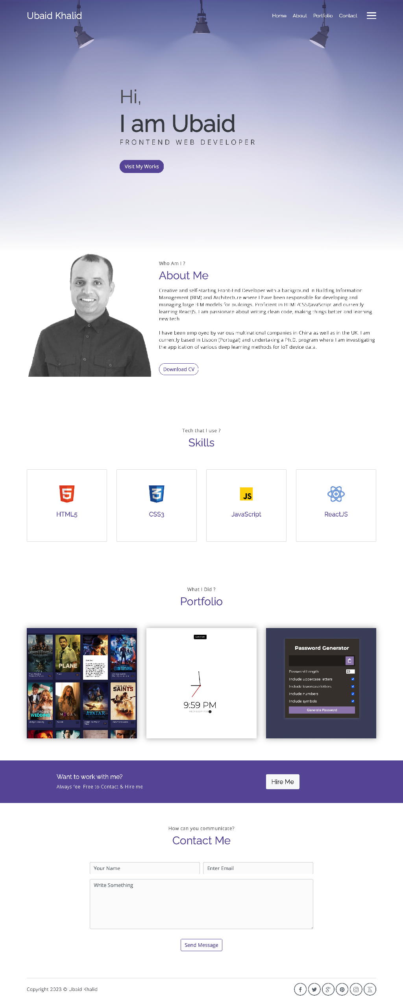

# My Front-End Portfolio Website - Version 1.0

I am creating the first version of my portfolio website. I am using "Meyawo – Free Bootstrap Portfolio Website Template" as a base for this website.

### Links

- Meyawo Template URL: [click here](https://themewagon.com/themes/free-bootstrap-portfolio-website-template-meyawo/)
- Repo URL: [click here](https://github.com/climaco-sarmiento/portfolio-website-v1)
- Live Site Preview URL: [click here](https://climaco-sarmiento.github.io/portfolio-website-v1/)

### Screenshot

## Author

- Website - [Ubaid Khalid](https://www.ubaidkhalid.dev)
- LinkedIn - [Ubaid Khalid](https://www.linkedin.com/in/ubaid-khalid-dev/)
